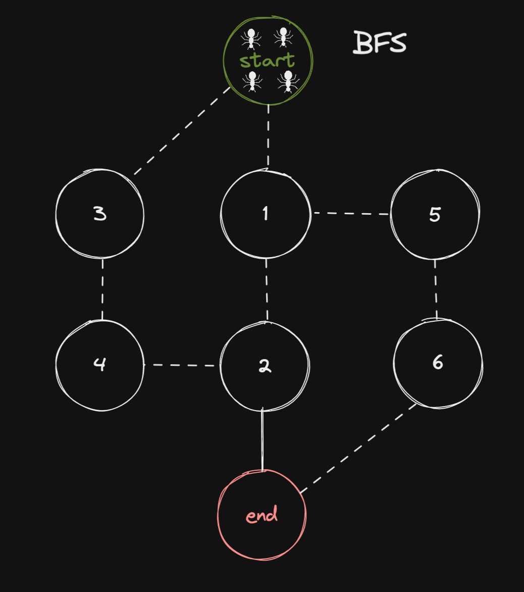

# 🐜 Lem-in

Lem-in is a Zone01 cursus project.  
The goal: move ants from the **start room** to the **end room** in as few turns as possible.  
It’s all about graph parsing, pathfinding, and optimization.

---

## 📖 Description
- Parse and validate an input map describing rooms and links.
- Build a graph to represent the anthill.
- Find optimal disjoint paths using graph algorithms (BFS / max-flow style).
- Distribute ants across paths to minimize the total number of turns.
- Print moves in the required `Lx-room` format.

---

## 🚀 Usage
Compile:

Run:
```bash
go run . test.txt
```

---

## 🗂 Example
Input:
```
3
##start
A 0 0
B 1 0
C 2 0
##end
D 3 0
A-B
B-C
C-D
```

Output:
```
L1-B
L1-C
L1-D
```

---

## 📸 Preview
<p align="center">
  
</p>

---

## 👥 Team
- [Ahmed Talbi](https://github.com/AhmedTalbii)  
- [Ilyass Aboudou](https://github.com/AboudouIlyass)  
- [Fatima Aaziz](https://github.com/fatimaaaziz)  

---

## 📝 Notes
- Project completed as part of Zone01 cursus.  
- Focused on graph theory, optimization, and clean code structure.  